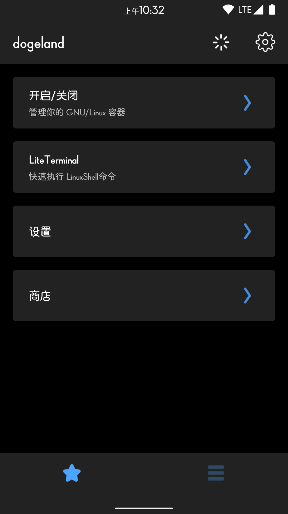
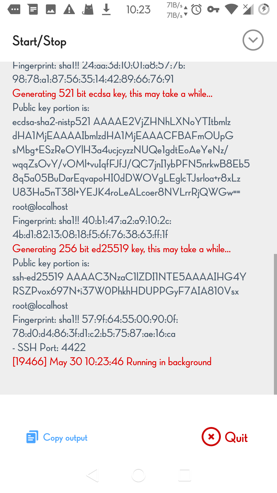
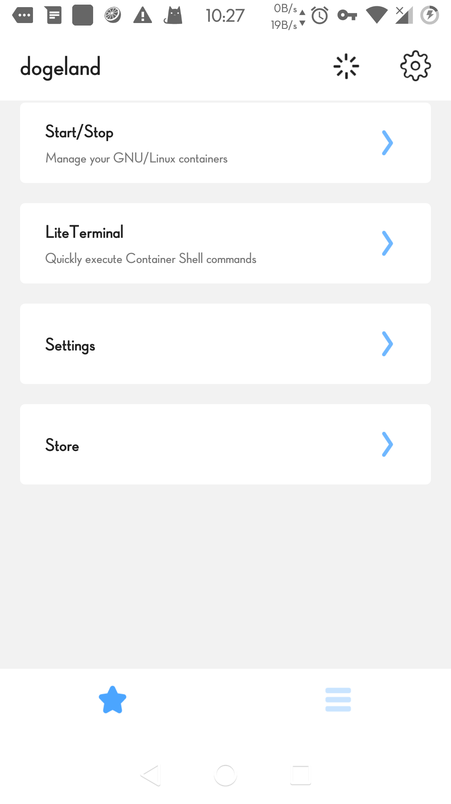
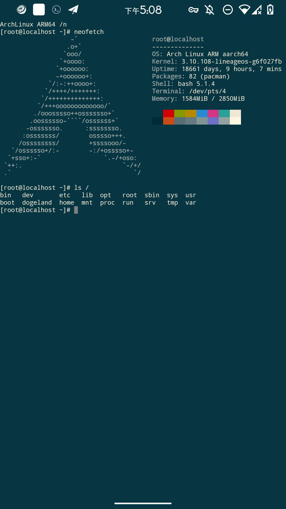

# dogeland

  
在Android上运行任意 GNU / Linux 发行版.  
proot + chroot + unshare 三容器引擎全向支持🌸  
arm(64)与x86_64全向架构支持🌹  

  
[rootfs仓库](https://cloud.189.cn/t/mqay2enyyuMj)
  
## 组件与依赖
  
busybox  
proot  
libandroid-shmem  
libtalloc  
util-linux  
dropbear  
  
## Wiki
  
[Click here](docs/guide.md)  
